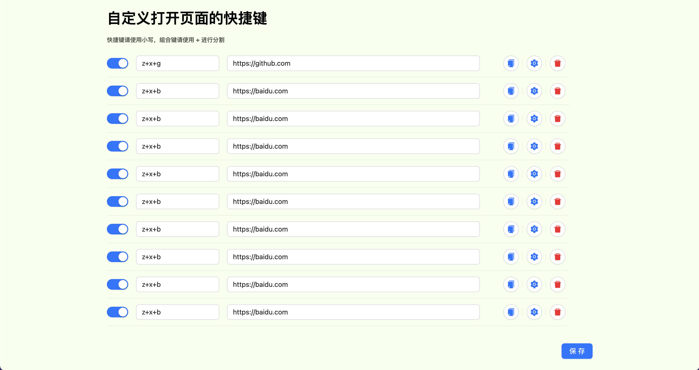

# QuickGo

chrome plugin - Customize shortcut keys for open pages.

🏖 使用方法：
1. 点击插件图标打开配置页面。
2. 在配置页面中配置页面地址和对应的快捷键，保存。
3. 在任意页面使用快捷键即可打开对应页面。

🚀 特点
1. 支持任意单键、组合键。
2. 支持一个快捷键打开多个页面。
3. 支持配置快捷键生效的页面。
4. a 标签添加 _blank，在新标签页打开

